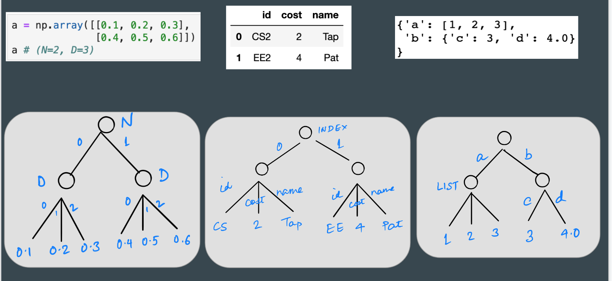

## Thinking And-Or Style



---

Machine Learning data pipelines comprise of two main data structures: *tables* and *tensors* (n-d arrays). For example, in Python, we can use `pandas` and `numpy` libraries to work with tables and tensors, respectively. Let's see how we can describe their shapes in the `aos` language in a unified manner.

Suppose `T` is a 4-dimensional tensor corresponding to a *batch* of images: each image has height `h`, width `w`, number of channels `c` and the batch has `b` elements.

We write the shape of `T` as a tuple `(b, c, h, w)`, where `b`, `c`, `h` and `w` are *names* given to individual dimensions of `T`. 

Now, consider how we access a pixel value from `T`: we pick a batch `b` index, then a `c` index, then `h` and then `w`. Only when we select indices from **all** of the dimensions of `T`, we can access a pixel value.

So, equivalently, we can write the shape of `T` as `(b and c and h and w)`, or `(b & c & h & w)` in short. 

Note that dimension identifiers are more than just *names*; each dimension is of *type* `continuous` or `categorical`. For example, `b`, `h` and `w` are `continuous`-typed, with values in range `[0,32)`, `[0,256)` and `[0, 256)` respectively. We may define `c` to be of type continuous (`[0-3)`) or categorical (`r`, `g`, `b`). 

Note that the type of a dimension is independent of the type of the object (e.g., tensor) that `d` participates in.

---

Suppose a table `D` has `n` rows and columns named `c1` and `c2`. Now, to select a data value from the table, we may first pick a row, **and** pick a column `c1` **or** `c2`. 

So, we write the shape of `D` as `(n and (c1 or c2))`. In short, `n & (c1|c2)`. 

Equivalently, we can write `(c1|c2) & n`, which corresponds to selecting first a column and then a row.   
Note how we are able to conveniently express shapes of tables and tensors using these concise `and-or` expressions. Now, let us take this further (to less common *mixed* data structures).

Imagine that we want to describe a data structure `M` which resembles the tensor `T`, except that the leaf value is not a scalar but a *dictionary* with two fields `k1` and `k2`, each of which contains a scalar value. 

How do we express the shape of `M`? `b & c & h & w & (k1 | k2)`. Intuitively, we need to select indices from `b`, `c`, `h`, `w`, *and* either `k1` or `k2` to access a data value.

Consider another interesting data structure `N` which is a nested dictionary of n-dimensional tensors `t1`, `t2` and `t3`, sketched below. 

```
{'a': {'c': <t1>, 'd': <t2>},
'b': <t3>
}
```
Assume, for simplicity, that the shape of each tensor is `(p & q)`.
Now, the shape of `N` is `( (a & (c & .. | d & .. )) | (b & ..) )`, which gets complicated to write. So, we introduce new names for the intermediate shapes.

Let us denote the *inner* shape `c & (p & q) | d & (p & q)` as `cd`. 
Now, the shape of `N` is `a & cd | b & p & q`.

Further, to distinguish dictionary keys (`a`, `b`) from dimensions over indices (`p`, `q`), we can write the shape of `N` as `a: cd | b: p & q` where `cd` = `c: p & q | d: p & q`.


